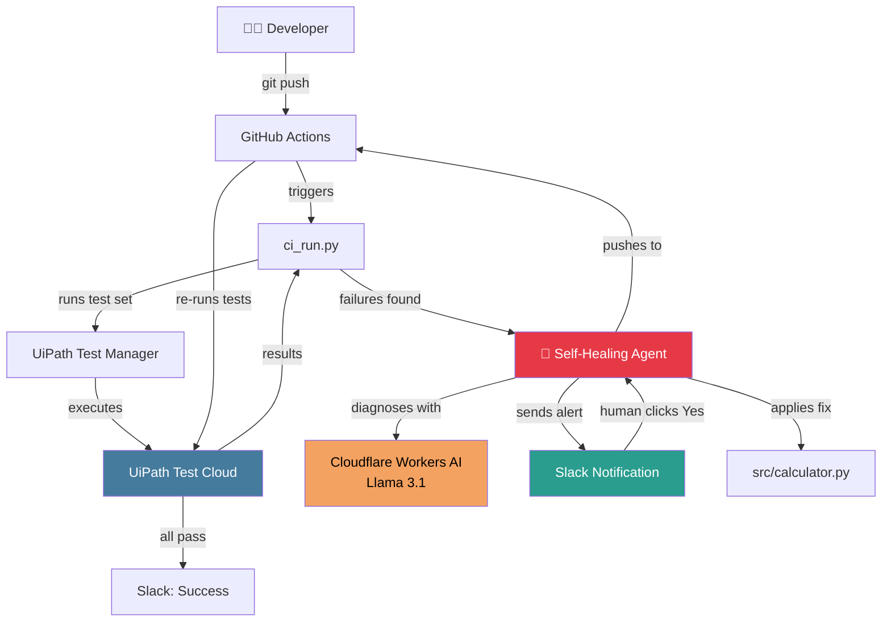
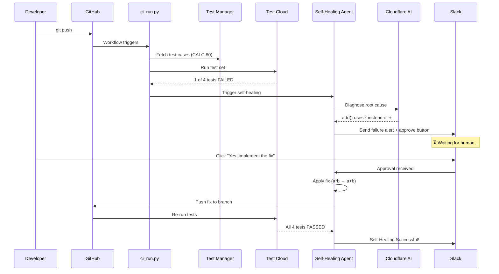

# Self-Healing Test Agent

> AI-powered test agent that auto-diagnoses failures and fixes code with human approval via Slack.

[](https://uipath-agenthack.devpost.com)
[](https://uipath-agenthack.devpost.com/details/tracks)
[](https://opensource.org/licenses/MIT)

## What it does

A developer pushes code → tests run → one fails → the agent diagnoses the bug → sends a Slack alert → waits for human approval → fixes the code → pushes to GitHub → tests pass.

**Zero manual intervention. One human click.**

## Architecture



## Pipeline Flow



## LangGraph State Machine


## Tech Stack

| Component | Technology |
|-----------|-----------|
| Orchestration | LangGraph (14 nodes, 17 edges) |
| Test Management | UiPath Test Manager |
| Test Execution | UiPath Test Cloud |
| AI Diagnosis | Cloudflare Workers AI (Llama 3.1 8B) |
| Notifications | UiPath Integration Service → Slack |
| CI/CD | GitHub Actions |
| Code Push | GitHub API |
| Agent SDK | UiPath Python SDK |

## Project Structure

```
agenthack-test-agent/
├── main.py                    # LangGraph unified graph (14 nodes)
├── demo.py                    # Demo entry point
├── ci_run.py                  # CI/CD orchestrator
├── src/
│   └── calculator.py          # Buggy source (intentional a*b)
├── tests/
│   └── test_calculator.py     # Test cases
├── test_generator/
│   ├── nodes.py               # 5 async nodes (fetch, analyze, filter, generate, execute)
│   ├── state.py               # TypedDict state definition
│   └── graph.py               # Graph builder (inlined into main.py)
├── approval-responder/
│   └── main.py                # Handles Slack button clicks, resumes agent
├── .github/
│   └── workflows/
│       └── uipath-test-heal.yml  # CI pipeline
├── langgraph.json             # Agent entry point config
├── uipath.json                # UiPath platform config
├── pyproject.toml             # Python dependencies
└── AGENTS.md                  # Documentation index
```

## Key Components

### 1. Unified Graph (`main.py`)

The agent is a single LangGraph state machine that chains test generation → execution → self-healing. Entry point: `main.py:graph`.

```python
from main import graph

result = await graph.ainvoke({
    "developer_code": CODE,
    "project_key": "CALC",
    "test_set_key": "CALC:80",
    "slack_channel": "new-channel",
    "branch": "main"
})
```

### 2. Test Generator (`test_generator/nodes.py`)

- **`_get_test_cases`** — Fetches from UiPath Test Manager
- **`_get_test_steps`** — Reads test case descriptions
- **`_parse_steps_from_description`** — Extracts steps from numbered lists
- **`_call_ai`** — Cloudflare Workers AI for analysis

### 3. Approval Responder (`approval-responder/main.py`)

Handles Slack button clicks and resumes the suspended agent job via `sdk.jobs.resume(inbox_id=..., payload=...)`.

### 4. CI Pipeline (`.github/workflows/uipath-test-heal.yml`)

Triggers on `push to main`. Runs `ci_run.py` which orchestrates Test Cloud execution and agent invocation.

## Getting Started

### Prerequisites

- Python 3.12+
- UiPath Automation Cloud account
- Cloudflare Workers AI API key
- Slack workspace with UiPath Integration Service

### Setup

```bash
# Clone
git clone https://github.com/MahmoudAdelbghany/agenthack-test-agent.git
cd agenthack-test-agent

# Install
python -m venv .venv
source .venv/bin/activate
pip install uv && uv sync

# Configure
cp .env.example .env
# Fill in UIPATH_ACCESS_TOKEN, CLOUDFLARE_ACCOUNT_ID, CLOUDFLARE_API_TOKEN

# Setup UiPath coded agent
uip codedagent setup
```

### Run Demo

```bash
python demo.py
```

### Run CI Pipeline

```bash
python ci_run.py \
  --project-key CALC \
  --test-set-key CALC:80 \
  --slack-channel new-channel \
  --process-key <YOUR_PROCESS_KEY> \
  --folder-key <YOUR_FOLDER_KEY> \
  --auto-approve
```

## Environment Variables

| Variable | Description |
|----------|-------------|
| `UIPATH_ACCESS_TOKEN` | UiPath platform access token |
| `UIPATH_PROJECT_KEY` | Test Manager project key (e.g., CALC) |
| `UIPATH_TEST_SET_KEY` | Test set key (e.g., CALC:80) |
| `CLOUDFLARE_ACCOUNT_ID` | Cloudflare account ID |
| `CLOUDFLARE_API_TOKEN` | Cloudflare API token |
| `GITHUB_TOKEN` | GitHub personal access token |

## License

MIT
