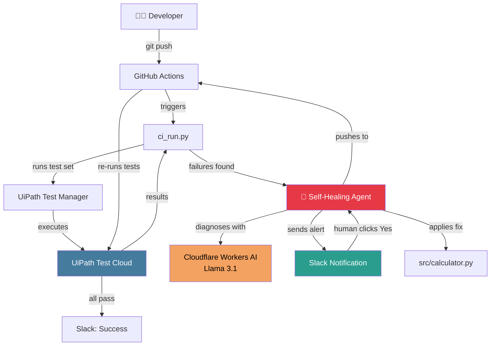
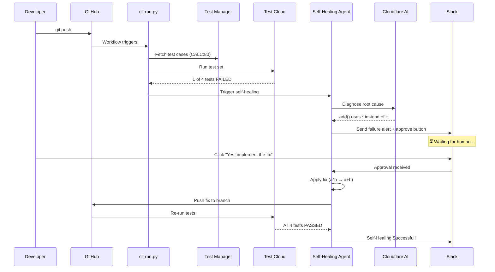

# Self-Healing Test Agent

> AI-powered test agent that auto-diagnoses failures and fixes code with human approval via Slack.

[](https://uipath-agenthack.devpost.com)
[](https://uipath-agenthack.devpost.com/details/tracks)
[](https://opensource.org/licenses/MIT)

## Project Description

The Self-Healing Test Agent is a coded agent built on the UiPath Platform that automates the entire test lifecycle — from test generation to failure diagnosis to code fix — while keeping humans in the loop at critical decision points.

**The Problem:** When tests fail, developers manually read logs, diagnose root causes, write fixes, and push changes. This process is slow, error-prone, and happens at the worst times (3 AM production failures).

**The Solution:** An autonomous agent that:
1. **User Story → Test Cases** — Reads structured test cases from UiPath Test Manager
2. **AI Filtering** — Reads the code, identifies relevant functions, skips unrelated tests
3. **Test Generation** — Generates executable pytest files from test case descriptions
4. **Test Execution** — Runs tests in UiPath Test Cloud
5. **Diagnosis** — Identifies root cause with Cloudflare Workers AI
6. **Human Approval** — Sends Slack notifications with approve/reject buttons
7. **Auto-Fix** — Applies fix and pushes to GitHub upon human approval
8. **Verification** — Re-runs tests to confirm the fix works

**One `git push` triggers the entire flow. One human click completes it.**

## Agent Type

> **This solution uses Coded Agents.**
>
> The entire agent is built as a Python coded agent using LangGraph (14 nodes, 17 edges) and the UiPath Python SDK. It was developed using **MiMo** (an AI coding agent) through UiPath for Coding Agents, demonstrating the power of coding agents for enterprise automation development.

## UiPath Components Used

| Component | Usage |
|-----------|-------|
| **UiPath Test Manager** | Test case management, test sets, execution tracking |
| **UiPath Test Cloud** | Test execution runtime |
| **UiPath Orchestrator** | Coded agent deployment, job management, suspension/resume |
| **UiPath Integration Service** | Slack connection with interactive button triggers |
| **UiPath Python SDK** | Test Manager API, Orchestrator API, Integration Service API |
| **UiPath CLI (`uip`)** | Test Manager operations, coded agent setup |
| **UiPath for Coding Agents** | Built with MiMo (AI coding agent) |

**External services:**
- Cloudflare Workers AI (Llama 3.1 8B) — Root cause diagnosis
- Slack — Human-in-the-loop approval notifications
- GitHub — Code hosting, CI/CD via GitHub Actions

## Architecture



## Pipeline Flow



## LangGraph State Machine

```mermaid
graph LR
    START([START]) --> FetchTestCases[Fetch Test Cases]
    FetchTestCases --> AnalyzeCode[Analyze Code]
    AnalyzeCode --> FilterCases{Filter Relevant}
    FilterCases -->|relevant| GenerateTests[Generate Executable Tests]
    FilterCases -->|none relevant| End1([END])
    GenerateTests --> TriggerExecution[Trigger Test Cloud]
    TriggerExecution --> WaitForResults[Wait for Results]
    WaitForResults -->|all pass| AllPassed[All Passed ✓]
    WaitForResults -->|failures| Diagnose[Diagnose with AI]
    Diagnose --> SendSlack[Send Slack Alert]
    SendSlack --> WaitForApproval{Human Decision}
    WaitForApproval -->|Yes| ApplyFix[Apply Fix]
    WaitForApproval -->|No| Skip([SKIP])
    ApplyFix --> PushToGitHub[Push to GitHub]
    PushToGitHub --> RerunTests[Re-run Tests]
    RerunTests -->|pass| AllPassed
    RerunTests -->|fail| Diagnose
    AllPassed --> NotifySuccess[Notify Success]
    NotifySuccess --> End2([END])

    style Diagnose fill:#e63946,color:#fff
    style WaitForApproval fill:#f4a261,color:#000
    style ApplyFix fill:#2a9d8f,color:#fff
    style AllPassed fill:#2a9d8f,color:#fff
```



## Project Structure

```
agenthack-test-agent/
├── main.py                    # LangGraph unified graph (14 nodes)
├── demo.py                    # Demo entry point
├── ci_run.py                  # CI/CD orchestrator
├── src/
│   └── calculator.py          # Buggy source (intentional a*b)
├── tests/
│   └── test_calculator.py     # Test cases
├── test_generator/            # Integrated from FatmaMahmoudBadr/uipath-test-agent
│   ├── __init__.py
│   ├── nodes.py               # 5 async nodes (fetch, analyze, filter, generate, execute)
│   ├── state.py               # TypedDict state definition
│   └── graph.py               # Graph builder (inlined into main.py)
├── approval-responder/
│   └── main.py                # Handles Slack button clicks, resumes agent
├── .github/
│   └── workflows/
│       └── uipath-test-heal.yml  # CI pipeline
├── langgraph.json             # Agent entry point config
├── uipath.json                # UiPath platform config
├── pyproject.toml             # Python dependencies
└── AGENTS.md                  # Documentation index
```

## Full Pipeline: User Story → Executable Tests

The complete flow from business requirement to running tests:

```mermaid
graph LR
    subgraph "UiPath Test Manager"
        US[📝 User Story] --> TC[📋 Test Cases]
        TC --> TS[🗂️ Test Set<br/>CALC:80]
    end

    subgraph "Test Generator Agent"
        TS -->|fetch| Fetch[uip tm testcases list]
        Fetch --> Analyze[AI reads src/calculator.py]
        Analyze -->|identifies functions| Filter[Filter relevant cases]
        Filter -->|add(), subtract()| Gen[Generate pytest files]
        Gen -->|Cloudflare AI| Tests[4 executable test files]
    end

    subgraph "Test Execution"
        Tests --> Run[uip tm testsets run]
        Run --> Results{Pass/Fail?}
        Results -->|fail| Heal[Self-Healing Agent]
        Results -->|pass| Done[✅ All Clear]
    end

    subgraph "Self-Healing"
        Heal --> Diag[AI Diagnose Root Cause]
        Diag --> Slack[Slack Alert]
        Slack -->|human approves| Fix[Apply Fix]
        Fix --> Push[Push to GitHub]
        Push --> Run
    end

    style US fill:#f4a261,color:#000
    style Filter fill:#e63946,color:#fff
    style Gen fill:#2a9d8f,color:#fff
    style Heal fill:#e63946,color:#fff
    style Done fill:#2a9d8f,color:#fff
```

### How it works step by step:

1. **User Story in UiPath Test Manager** — Business requirements are captured as test cases in UiPath Test Manager (e.g., "Add two positive integers: assert add(2,3) == 5")

2. **Agent Fetches Test Cases** — Uses `uip tm testcases list` to get all test cases from the project (CALC), then `uip tm testcases list-steps` to read detailed steps

3. **AI Filters Relevant Cases** — Cloudflare Workers AI reads the developer's code (`src/calculator.py`), identifies which functions changed (e.g., `add()`, `subtract()`), and filters out irrelevant tests (e.g., multiply, divide, modulo)

4. **Generates Executable Tests** — For each relevant test case, the agent generates a real pytest file with proper assertions

5. **Runs in UiPath Test Cloud** — Triggers the test set and monitors execution

6. **Self-Heals on Failure** — Diagnoses root cause, sends Slack alert, waits for approval, applies fix, pushes to GitHub

**External test generator:** Integrated from [FatmaMahmoudBadr/uipath-test-agent](https://github.com/FatmaMahmoudBadr/uipath-test-agent/tree/main) — the `test_generator/` package was inlined into the unified graph.

## Setup Instructions

### Prerequisites

- Python 3.12+
- UiPath Automation Cloud account with:
  - Test Manager project (CALC)
  - Test set (CALC:80)
  - Orchestrator folder
  - Integration Service Slack connection
- Cloudflare Workers AI API key
- Slack workspace with UiPath app installed
- GitHub personal access token

### Step 1: Clone and Install

```bash
git clone https://github.com/MahmoudAdelbghany/agenthack-test-agent.git
cd agenthack-test-agent

python -m venv .venv
source .venv/bin/activate
pip install uv && uv sync
```

### Step 2: Configure Environment

Create `.env` file:

```env
UIPATH_ACCESS_TOKEN=your_token_here
UIPATH_PROJECT_KEY=CALC
UIPATH_TEST_SET_KEY=CALC:80
UIPATH_FOLDER_KEY=your_folder_key
UIPATH_ORGANIZATION=your_org
UIPATH_TENANT=your_tenant
CLOUDFLARE_ACCOUNT_ID=your_account_id
CLOUDFLARE_API_TOKEN=your_api_token
GITHUB_TOKEN=your_github_token
SLACK_CHANNEL=new-channel
```

### Step 3: Setup UiPath Coded Agent

```bash
uip codedagent setup
```

### Step 4: Run Demo (Local)

```bash
python demo.py
```

This runs the agent locally. Check Slack for the approval notification.

### Step 5: Deploy to UiPath Automation Cloud

```bash
uip codedagent deploy
```

### Step 6: Enable CI Pipeline

```bash
gh workflow enable "UiPath Test & Self-Heal Pipeline" --repo MahmoudAdelbghany/agenthack-test-agent
```

### Step 7: Trigger the Flow

```bash
# Push broken code to trigger CI
git add src/calculator.py
git commit -m "feat: add calculator functions"
git push origin main
```

The CI pipeline will:
1. Run tests in UiPath Test Cloud
2. Detect the failure
3. Trigger the self-healing agent
4. Send Slack notification
5. Wait for your approval
6. Apply fix and push

## Environment Variables

| Variable | Description | Required |
|----------|-------------|----------|
| `UIPATH_ACCESS_TOKEN` | UiPath platform access token | Yes |
| `UIPATH_PROJECT_KEY` | Test Manager project key | Yes |
| `UIPATH_TEST_SET_KEY` | Test set key | Yes |
| `UIPATH_FOLDER_KEY` | Orchestrator folder key | Yes |
| `UIPATH_ORGANIZATION` | UiPath organization name | Yes |
| `UIPATH_TENANT` | UiPath tenant name | Yes |
| `CLOUDFLARE_ACCOUNT_ID` | Cloudflare account ID | Yes |
| `CLOUDFLARE_API_TOKEN` | Cloudflare API token | Yes |
| `GITHUB_TOKEN` | GitHub personal access token | Yes |
| `SLACK_CHANNEL` | Slack channel name | Optional |

## License

MIT
